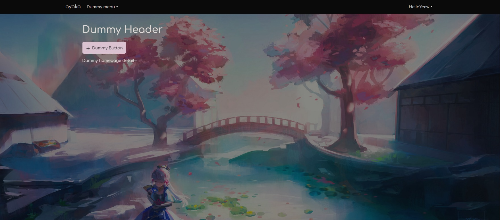
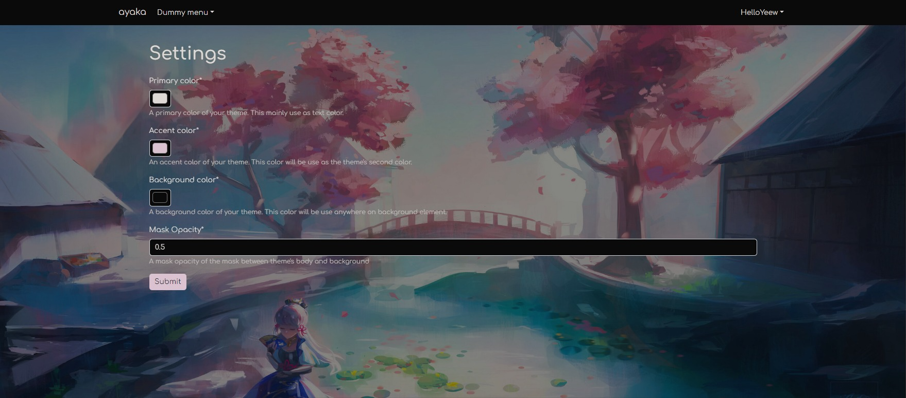

# Sankasaint Election Committee
 EC app for election in Software project subject to select James Brucker as a next president powered by [ayaka](https://github.com/HelloYeew/ayaka).

## What's include in this template?

- Full login and register system
- Full color customization settings for each user
- Initial styling and template to make you don't need to worry about website's styling
- Full admin theme customization
- Full project configuration to make your project development easier and easy to deploy
- Postgresql configuration for production

## Demo




## Project that use this template

- [meaqua](https://github.com/HelloYeew/meaqua) - Startpage for your browser with built-in editors, full customization and built-in style sharing system

## Dump database data

```bash
python manage.py dumpdata apps > seed/apps.json --indent 4
```

## Load database data

```bash
python manage.py loaddata seed/apps.json
```